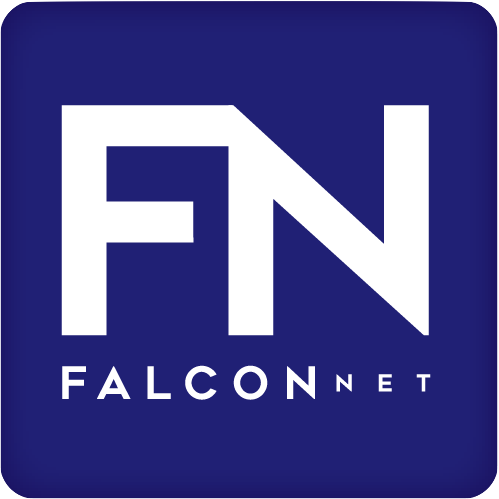

<!-- FN LOGO -->
 

  

  <h3 align="center">FalconNet</h3>

  

    Community-compiled mobile and web application enabling day-to-day operations at USAFA
  

<!-- TABLE OF CONTENTS -->

  
<h2 style="display: inline-block">Table of Contents</h2>

  <ol>
    <li>
      <a href="#about-the-project">About The Project</a>
      <ul>
        <li><a href="#built-with">Built With</a></li>
        <li><a href="#the-team">The Team</a></li>
      </ul>
    </li>
  </ol>

<!-- ABOUT THE PROJECT -->
## About The Project

### Built With

* <a href="https://make.powerapps.com/">Power Apps</a>
* Love
* Tears

### The Team

<ul>
  <li><a href="mailto:c23Anna.Little@afacademy.af.edu">Anna Little</a>: Director</li>
  <li><a href="mailto:C23Samuel.Lowery@afacademy.af.edu">Samuel Lowery</a>: Deputy Director</li>
  <li><a href="mailto:C23Jacob.Garbrecht@afacademy.af.edu">Jacob Garbrecht</a>: IT Officer</li>
</ul>
